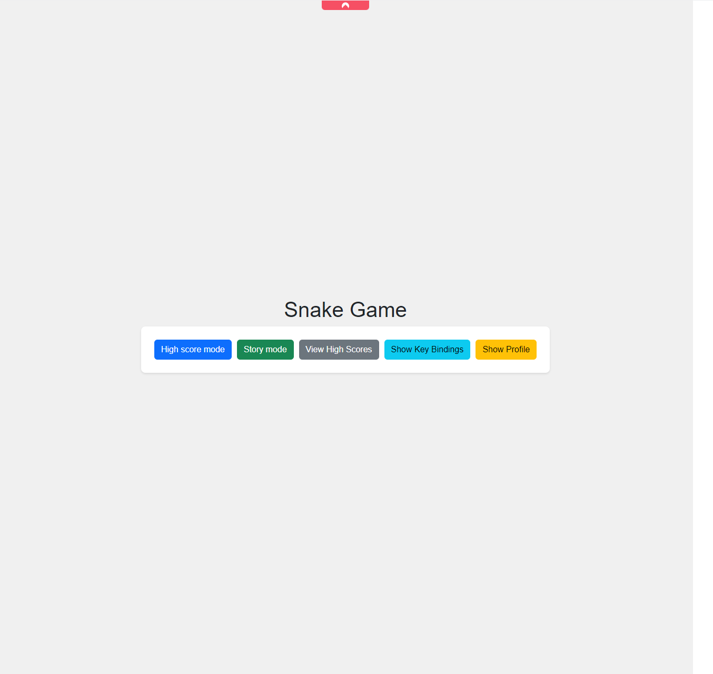
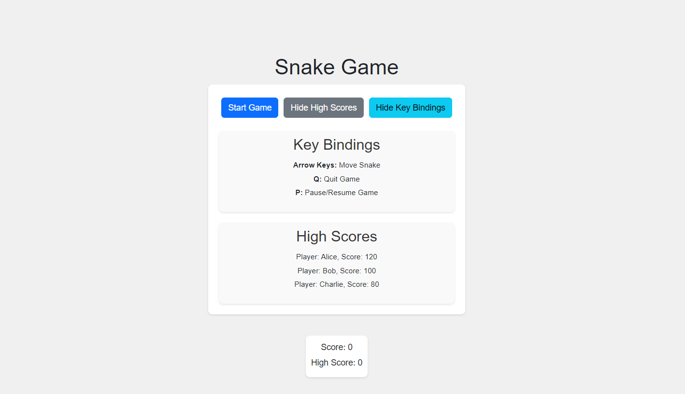
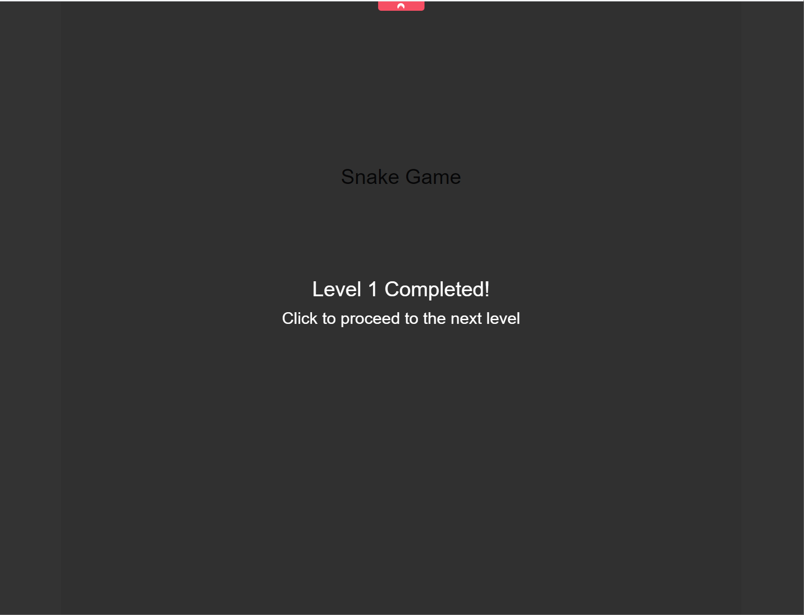
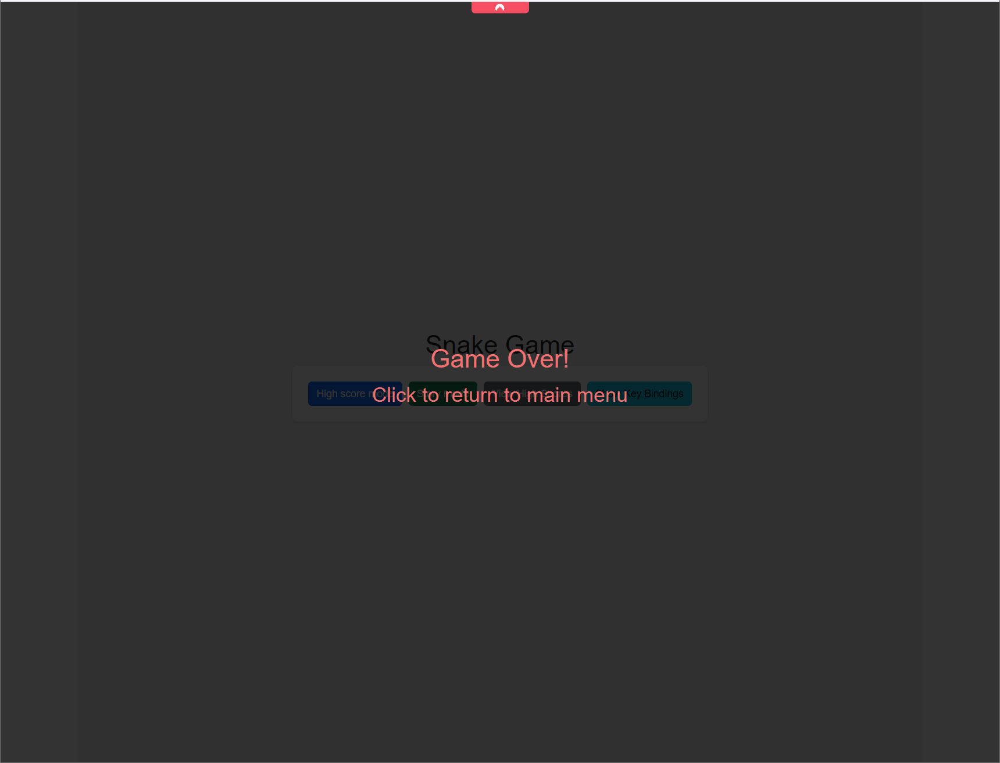
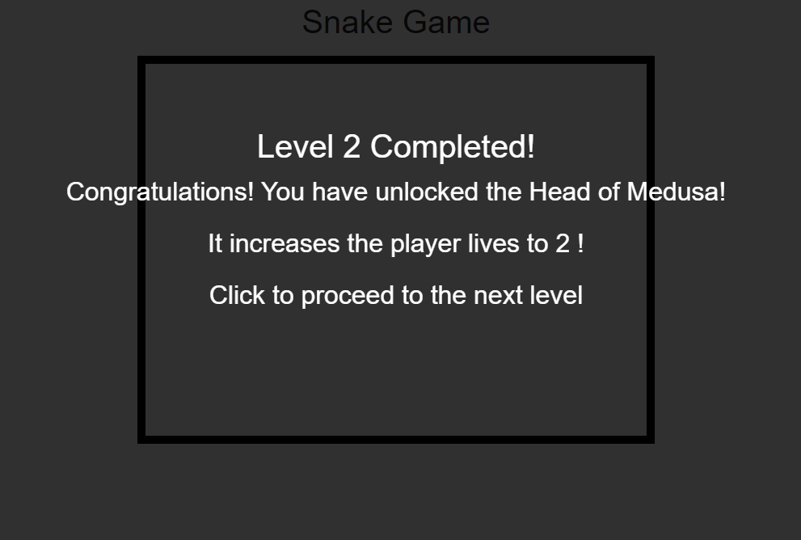
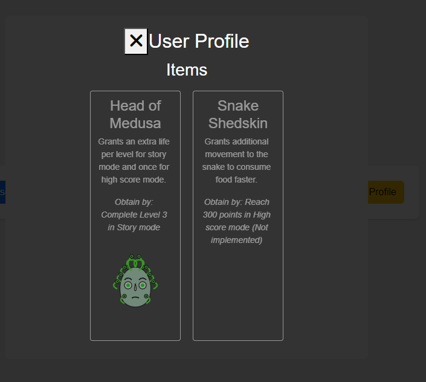

# ReactJS_Snake

This project was bootstrapped with [Create React App](https://github.com/facebook/create-react-app).

Traditional snake game with js and react

## Requirements
1)  Navigate to `./backend/` and run `npm install`.
2) Once done, run `node server.js` and check it is successfully running
3) Go to `http://localhost:3000/api/high-scores` and check the json 
4) In terminal, go to `./frontend/` and run `npm install`.
5) Once done, run `npm start` and open `http://localhost:3001` or the chosen port
6) Ensure there is a menu as shown below:

## Features

Can toggle the high scores and key bindings by toggling on the main menu

Each time a level is passed the success screen is rendered:

Each time a level or high score mode fails the game over screen is rendered:

If the user beats level 2 in story mode then they unlock the Head of Medusa item.

 * Now that lives are increased to 2, upon collision to an obstacle the user does not immediately die.
 * Instead the player lives are reduced by 1 and the snake immediately reverts direction to avoid further collision.

### Profile tab

Profile tab indicates the possible items that are available to the game.
* Name of item
* Information about the benefits provided when equipped
* the objective to complete to unlock each item

### Single player game
- Story mode
  - Incrementing levels of difficulty
  - Level 1 has to capture 5 food items with no obstacles
  - Level 2 has some obstacles and will unlock `Head of Medusa`
  - Level 3 has obstacles surrounding the screen to prevent crossover
  - Level 5 could be a boss and provide another item (Not implemented)
    - Move faster
    - Increase lives (pve instead of pvp?)
- High score mode

### Multiplayer (In Roadmap)

Users can compete in the same area to reach certain points first i.e. 100
- i.e. if user hits on other user or obstacle then deduction of 20 points would occur
- Items can help with preventing the point deduction and once used it is on cooldown until it recharges (?)
- Ranking mode where people of similar ranking play against each other and score points
- Weekly competitions

Feel free to send us for further information and contact us for suggestions!
